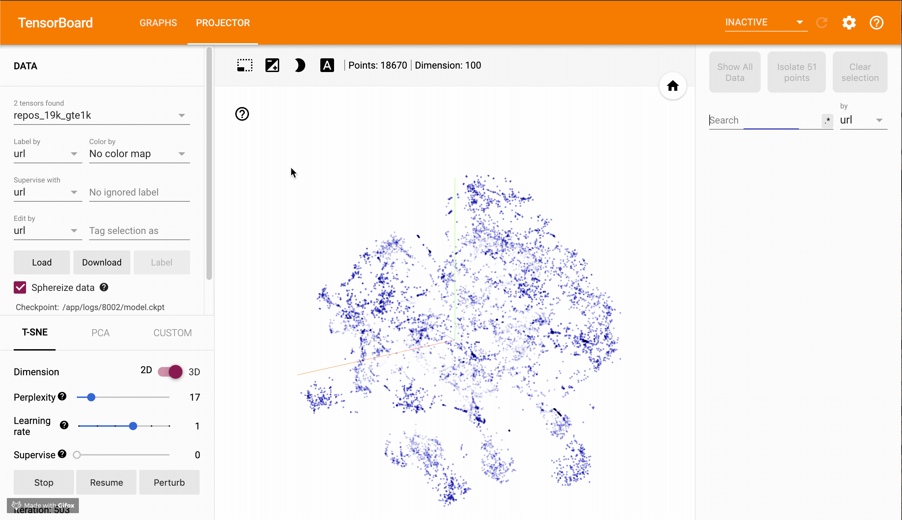

# GitHub repositories and users recommendations by embeddings

## Problem Statement
Currently, GitHub has two possibilities to explore users and repositories:
1. Direct search by search term leveraging names and tags.
2. Recommender system under 'Explore' tab which gives suggestions to a user based on his usage of service.
However, there is no possibility to perform a search of connected entities. E.g., find repositories or users highly related to each other.

## Goal of the Project
The goal of this project is to build GitHub repository search/recommender system, which would allow exploring connected repositories and people, by leveraging the underlying graph structure of the repositories database.

## Implemented ML solution
It was decided to build graph nodes embeddings (`repo2vec` and `user2vec`) for the entire GitHub database using [PyTorch-BigGraph (PBG)](https://github.com/facebookresearch/PyTorch-BigGraph). On top of the embeddings representation, we have built query tool with the ranking engine.

Data: [GHTorrent](https://github.com/ghtorrent) MySQL dumps (`2019-06-01`, later `2021-03-06`).

> **Note (2026-08):** GHTorrent is defunct — its download host no longer resolves and the
> `ghtorrent.org` domain has changed hands. Monthly dumps from 2013-10 to 2018-03 do
> survive on the Internet Archive; anything after that is gone.
> [GH Archive](https://www.gharchive.org/) is the live alternative, but it is not a drop-in
> replacement: GitHub trimmed its event payloads in October 2025, so repository `language`
> and timestamps are no longer in the stream at all and have to be fetched separately.
> `docs/data-sources.md` records what is still available and what each source actually
> covers. The published embeddings and the demo above are unaffected.

## v2

Work on a rebuilt pipeline lives on the `dev` branch: `V2_PLAN.md` for the plan and
findings, `v2/` for the code (GH Archive → DuckDB graph → node2vec → metadata enrichment),
and `docs/` for two dated surveys — of embedding viewers, and of where GitHub activity data
can still be got.

## To run our pipeline
1. Change `resources/config.template.json` to `resources/config.json` with your info;
2. Download SQL dump you like (here we use `2019-06-01`) at `data/` folder (run `db_download.sh` script (at terminal));
3. Run `project_notebook.ipynb` notebook;
4. Export the embeddings for the projector and serve them as static files — see `tb/README.md`
   (the old docker + TensorBoard 1.x setup it describes is superseded: the projector is a
   client-side app, so plain static hosting of the tensors is enough);
5. Modify code the way you like to find some new insights and share with us!

## Demo
Visualizations of the different tensors (embeddings) are available in the TensorFlow Embedding Projector:

**https://projector.tensorflow.org/?config=https://tb-gh-recs.hel.sergibro.me/config.json**

Four tensors are served: `repos_25k_gte1k` and `users_73k_gte500` (built from the
`2021-03-06` dump), plus the original `repos_19k_gte1k` and `users_48k_gte100` from
`2019-06-01` for comparison. The projector runs entirely in your browser; only the
tensors and their metadata are fetched from our host.

Hints:
- open from desktop browser (it fetch hundreds of MB for larger tensors and computations done on the client side!);
- for better visual experience run T-SNE instead of PCA for `500-1K` iterations on large tensors with `5-15` perplexity and learning rate set to `1` (from our experience); for smaller tensors you can play more due to fewer computations (but losing in data points);
- you may choose feature to be colored by (language for repos, type for users, etc.)

## How-to perform a search:

---
**Contacts**: https://t.me/sergibro
